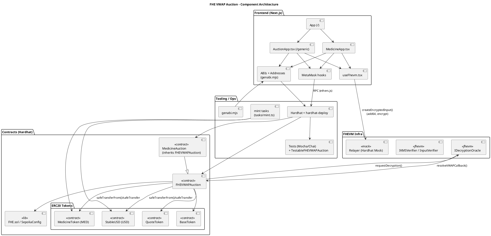
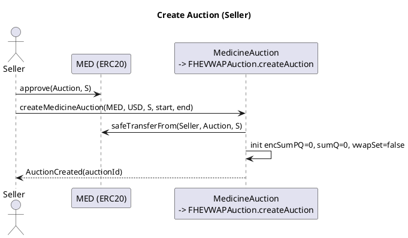
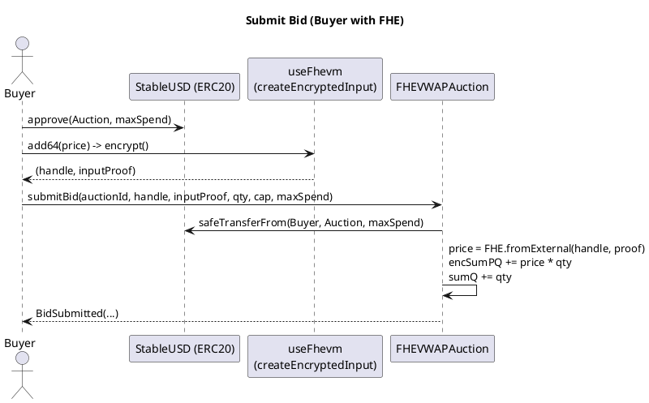
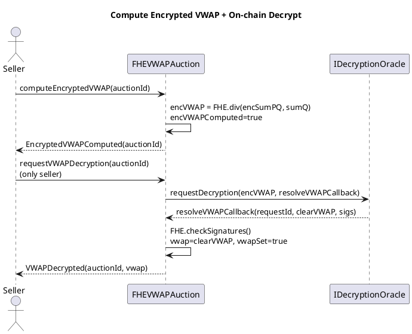
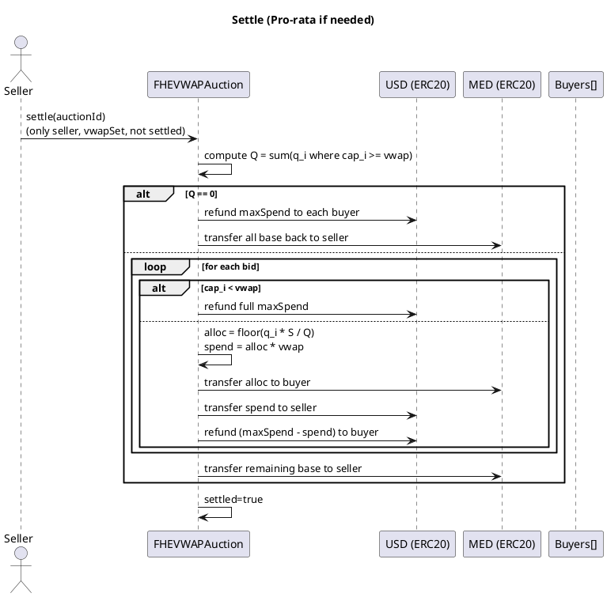

# FHE VWAP Medicine Auction (FHEVM Full‑Stack)

Privacy‑preserving batch auction using Fully Homomorphic Encryption (FHE) on EVM. Sellers list an amount of base tokens (medicine kits), buyers submit bids with encrypted prices, and the VWAP (Volume‑Weighted Average Price) is computed homomorphically on‑chain and then decrypted via the FHEVM oracle. Settlement happens at the final public VWAP.

## Deployed Addresses (current demo)

- MedicineAuction: `0x16b33b051FdC929163Cdc7832fecDa81eE63fB6A`
- MedicineToken (MTK): `0x89227Cf13e16f652D075C7495752bc4F3F15A770`
- StableUSD (sUSD): `0x08b2F97b8266740153391F1EdEf7933D26C5fDCa`

## Monorepo Layout

- `packages/fhevm-hardhat-template/`: Smart contracts, deployment, tasks and tests (Hardhat)
- `packages/site/`: Next.js app (Medicine UI at `/`, Generic UI at `/generic`)
- `scripts/install.mjs`: One‑shot dev setup (install, compile, deploy, genabi)

## Quickstart

1) Start Hardhat node
```sh
cd packages/fhevm-hardhat-template
npx hardhat node --verbose
```

2) Deploy contracts (localhost)
```sh
npx hardhat deploy --network localhost
```

3) Generate ABIs and addresses for the frontend
```sh
cd ../../packages/site
npm run genabi
```

4) Run the frontend (mock mode is supported automatically when on Hardhat)
```sh
npm run dev
# open http://localhost:3000
```

Connect MetaMask to Hardhat:
- RPC: http://127.0.0.1:8545
- Chain ID: 31337

## Using the dApp (Medicine UI)

1) Connect wallet on the root route `/`.
2) Create auction: define Kits (S) and time window (minutes from now). The app validates inputs and approves MTK escrow.
3) Submit bids (municipalities): encrypt price in the browser (FHEVM mock) and approve sUSD maxSpend.
4) After the auction ends, request on‑chain VWAP decryption (seller‑only). The contract asks the FHE oracle; once decrypted, VWAP becomes public.
5) Settle (seller‑only): allocates pro‑rata if needed, transfers MED to buyers, sends sUSD to seller, refunds leftovers.

The Generic UI remains available at `/generic` for a neutral, non‑medicine themed demo.

## Architecture (PlantUML)

Component view


Lifecycle: Create Auction


Lifecycle: Submit Bid (FHE)


Lifecycle: Compute + On‑chain Decrypt VWAP


Lifecycle: Settle


## Contracts

- `FHEVWAPAuction`: Core logic for encrypted bidding, homomorphic aggregation, on‑chain decryption and settlement. Uses `SafeERC20` and `ReentrancyGuard`.
- `MedicineAuction`: Thin wrapper with medicine semantics (`createMedicineAuction`, `submitMunicipalityBid`).
- `MedicineToken` (MTK), `StableUSD` (sUSD), plus generic `BaseToken`/`QuoteToken` for the generic demo.

Key invariants and guards:
- Prevent same token for base/quote.
- Seller‑only for decrypt and settle.
- Encrypted math on `euint64`; clear quantities use `uint256` (see notes below).

## FHEVM Notes

- Price inputs are encrypted client‑side (mock relayer in dev), sent as `(handle, inputProof)`.
- The contract aggregates `encSumPQ += price * qty` and later computes `encVWAP = encSumPQ / sumQ`.
- On‑chain decryption is requested via `FHE.requestDecryption`, with signatures verified in `resolveVWAPCallback`.

### How FHE is implemented in this project (end‑to‑end)

1) Data model and domains
- Bidders provide price as an encrypted 64‑bit unsigned integer (`euint64`).
- Quantities (`qty`) and totals (`sumQ`) are kept in clear as `uint256` for gas/UX simplicity, but when used inside FHE arithmetic they are cast to `uint64` to match the encrypted domain.
- The contract stores only the encrypted aggregate of price×qty (`encSumPQ`) and a clear sum of quantities (`sumQ`). Individual encrypted prices are not stored after aggregation, minimizing storage and privacy surface.

2) Client‑side encryption (browser)
- In the UI, we obtain an FHEVM instance (mock in dev) and build an encrypted input:
  - `const input = instance.createEncryptedInput(auctionAddress, userAddress);`
  - `input.add64(price);`
  - `const enc = await input.encrypt();`
- The result contains:
  - `handles[0]`: a `bytes32` opaque handle representing the ciphertext for the price (type‑checked as `externalEuint64` at the contract boundary).
  - `inputProof`: a proof binding data to the contract address, chain and user, verifiable by the on‑chain FHE input verifier.
- The dApp submits `submitBid(auctionId, handles[0], inputProof, qty, cap, maxSpend)` after approving the quote token for escrow.

3) On‑chain ingestion and homomorphic aggregation
- The contract verifies and converts the external ciphertext with:
  - `euint64 price = FHE.fromExternal(encPrice, inputProof);`
  - Under the hood, the FHE input verifier checks that the proof is valid and bound to this contract.
- The contract computes `product = FHE.mul(price, uint64(qty));` and updates `encSumPQ = FHE.add(encSumPQ, product);`
- It also updates `sumQ += qty` in clear.
- Only aggregated ciphertext (`encSumPQ`) and cumulative clear quantity (`sumQ`) are kept; no per‑bid ciphertext is persisted.

4) Computing encrypted VWAP
- After the auction window closes and there is demand, the seller (or any caller per your policy) calls:
  - `computeEncryptedVWAP(auctionId)`
- The contract performs a ciphertext/plaintext division (floor):
  - `encVWAP = FHE.div(encSumPQ, uint64(sumQ));`
- Permissions are prepared to enable later decryption:
  - `FHE.allowThis(encVWAP);` ensures the contract itself can request decryption in dev/mock contexts.
  - Optionally, the sample also calls `FHE.allow(encVWAP, msg.sender)` (configurable) to allow local inspection in mock.

5) On‑chain decryption via oracle
- The seller calls `requestVWAPDecryption(auctionId)`, which:
  - Converts the encrypted VWAP to a bytes handle: `FHE.toBytes32(encVWAP)`.
  - Calls `FHE.requestDecryption([...], resolveVWAPCallback.selector)` to the FHE oracle.
  - Emits `VWAPDecryptionRequested(auctionId, requestId)`.
- The oracle returns with `resolveVWAPCallback(requestId, clearVWAP, signatures)`:
  - The contract validates `FHE.checkSignatures(requestId, signatures)` and then persists `vwap=clearVWAP; vwapSet=true;` and emits `VWAPDecrypted(auctionId, vwap)`.
- From this point, VWAP is public and used by `settle`.

6) What remains private vs. public
- Private (never decrypted on‑chain): individual bid prices. They are only used inside homomorphic operations and then discarded.
- Public after decryption: the final VWAP (single scalar), used for settlement and shown in the UI.
- Public throughout: quantities, caps, and maxSpend escrow; settlement events and transfers.

7) Development (mock) vs. production
- In local development, the project uses the Hardhat FHEVM mock (relayer + verifiers) so that:
  - The browser can encrypt without native libraries.
  - The chain can verify `inputProof` and simulate oracle responses.
- In production, the same codepath integrates with Zama’s FHEVM oracle network for real decryption. The on‑chain callback stays the same.

8) Domain constraints and safeguards
- The encrypted arithmetic domain is `euint64`. Ensure `qty` and cumulative `sumQ` fit into 64 bits when used inside FHE operations (the sample can add `require(qty <= type(uint64).max)` guards if extremely large auctions are expected).
- Prices must also respect the 64‑bit domain. Caps and maxSpend remain clear but should be consistent with the price domain to avoid unrealistic values.

9) Gas and storage considerations
- Only one ciphertext (`encSumPQ`) and a clear accumulator (`sumQ`) are stored per auction; per‑bid ciphertexts are not retained. This keeps storage bounded and gas reasonable.
- The oracle decryption is a single request returning the final scalar (VWAP), not per‑bid.

10) Security notes specific to FHE flow
- The `inputProof` binding prevents reusing someone else’s ciphertext under a different context.
- Only the final VWAP is revealed; per‑bid prices remain confidential even after settlement.
- Liveness: decryption and settlement are seller‑gated in the sample. Consider a public finalize after a grace period to avoid stuck funds in adversarial scenarios.

## Tests

Run from Hardhat package:
```sh
cd packages/fhevm-hardhat-template
npm test
```

Coverage includes: create validation, S≥Q and S<Q settlement, refund path with no eligible bids, time‑window checks, and role checks. A `TestableFHEVWAPAuction` helper is used to set VWAP in tests without oracle signatures.

## Minting Helpers

Mint demo tokens (example):
```sh
cd packages/fhevm-hardhat-template
npx hardhat --network localhost mint:all --to 0xYOUR_WALLET
```

## Troubleshooting MetaMask + Hardhat

- If you restart the node, clear MetaMask activity/nonces and restart the browser to avoid cached state issues.
- Ensure you redeploy and `npm run genabi`, then refresh the frontend.

## Security & Limitations (high‑level)

- Liveness: only seller can finalize. Consider adding a public finalize after a grace period.
- Numeric domain: encrypted math uses 64‑bit; guard `qty`/`sumQ` if you plan huge values.
- ERC20 assumptions: fee‑on‑transfer/rebasing tokens are not supported.

## License

BSD‑3‑Clause‑Clear. See `LICENSE`.